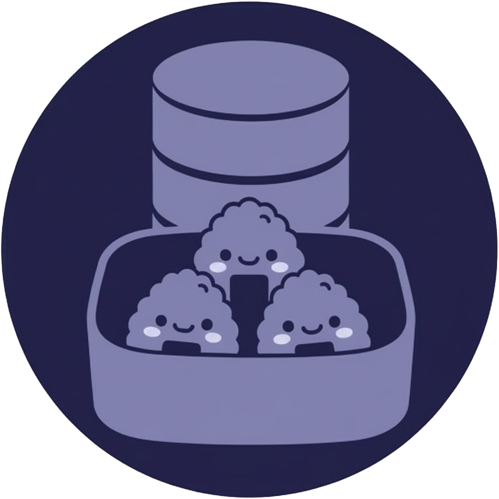

  

# MoeDB: Japanese Content Difficulty Database

MoeDB is a free, open-source database designed to assist Japanese language learners. The project provides a public list of media, including anime, dorama, and movies, that has been sorted and ranked according to its estimated linguistic difficulty.

  

The database allows users to quickly identify content that matches their current Japanese skill level, helping them select effective immersion material.

---

## 💻 Key Features

* **Difficulty Ranking:** All content is assigned scores based on objective linguistic data.
* **Large Content List:** The database currently contains over **9,000 entries** of various Japanese media types.
* **Filtering:** Users can search and filter content based on difficulty scores, media type, and other factors.

---

## 🔬 Data Analysis and Metrics

The core function of MoeDB is the analysis of content difficulty. This process is handled by a custom Python script.

### Data Source and Processing

1.  **Data Source:** The analysis relies on subtitle files sourced from the **kitsunekko-mirror** GitHub repository.
2.  **Subtitle Cleanup:** The script first cleans and standardizes the format of the raw subtitle files, which is necessary due to inconsistencies in the source data.
3.  **Filtering:** To ensure accurate scoring, the script removes non-vocabulary elements from the dialogue, such as proper nouns, sound effects, interjections, and numbers.
4.  **Vocabulary Rarity Scoring:** The remaining vocabulary (nouns, verbs, adjectives) is scored based on its frequency in the Japanese language using standard libraries.

### Core Metric: Vocab Density (%)

The most direct and reliable measure of a title's difficulty is the **Vocab Density (%)**.

**Vocab Density (%)** shows the percentage of "rare" or low-frequency words found within the total vocabulary of the media.

* A **low percentage** means the content uses mostly common, high-frequency words (easier).
* A **high percentage** means the content contains many rare or uncommon words (harder).

---

## 🛠️ Technology and Open Source

MoeDB is a fully open-source project.

| Component | Description |
| :--- | :--- |
| **Website** | Static website hosted for free on GitHub Pages. |
| **Data Source** | Subtitle files from the kitsunekko-mirror repository. |
| **Analysis** | Custom Python script that utilizes libraries like `sudachipy` and `wordfreq`. |

All project code, including the analysis scripts, is publicly available in this repository.

---

## 🤝 Contribution

This project is open to contributions. If you are interested in improving the data accuracy, submitting code for new features, or reporting data issues, please feel free to check the project's issues page or submit a pull request.